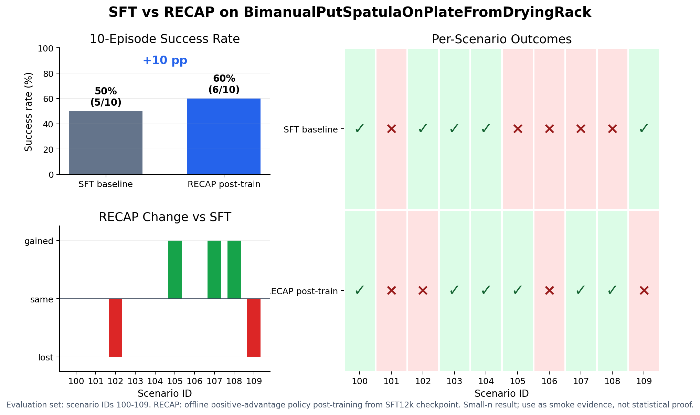
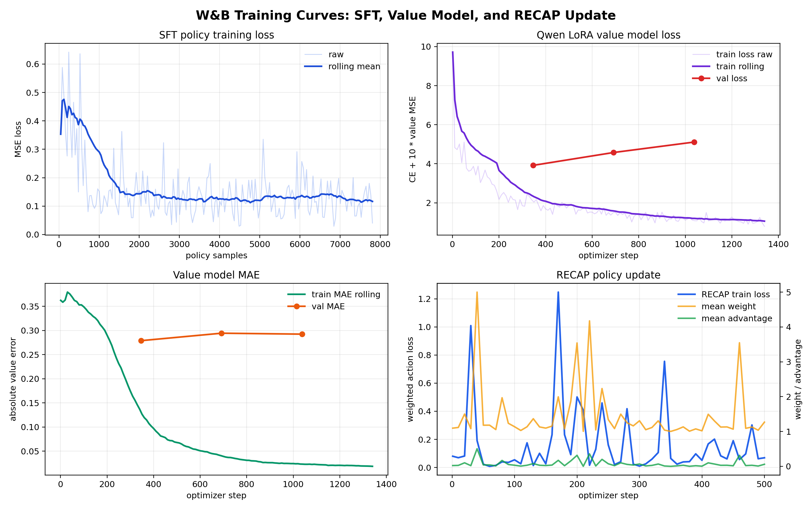
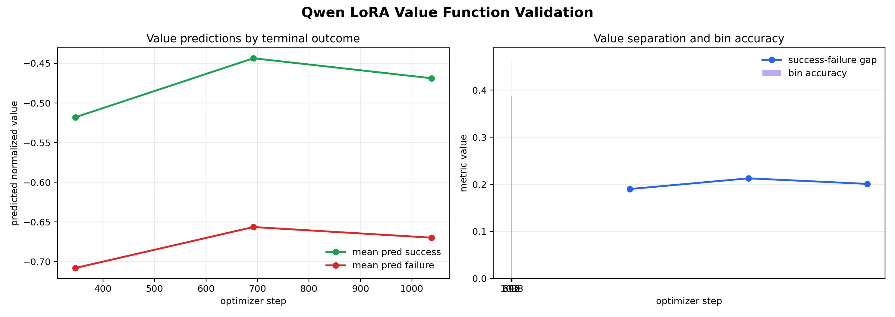
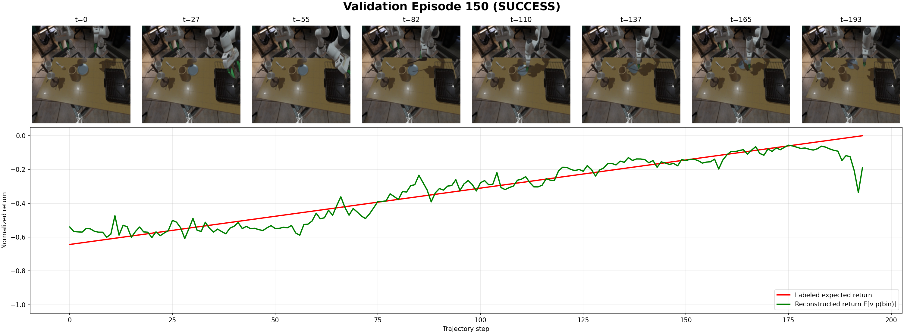
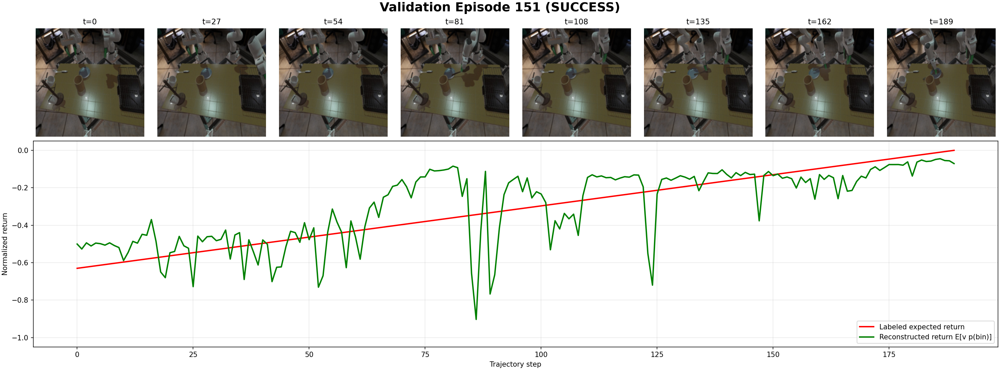
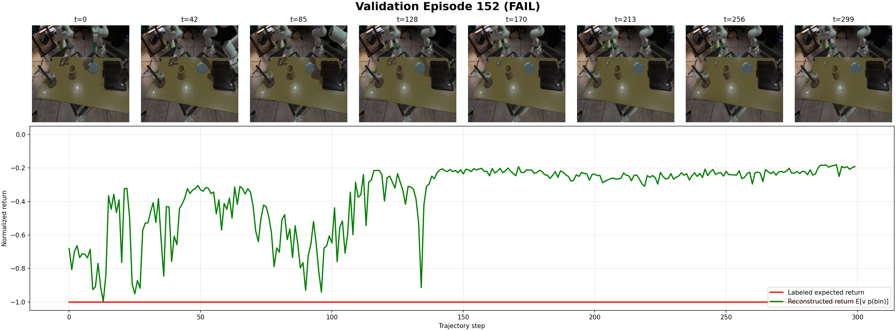
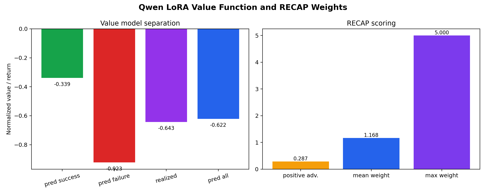

# RECAP Post-Training in VLA Foundry

This fork turns VLA Foundry into an end-to-end RECAP post-training sandbox for
robotics policies in TRI LBM Eval.

The current experiment is intentionally narrow:

- **Task:** `BimanualPutSpatulaOnPlateFromDryingRack`
- **Base policy:** Foundry Qwen3VLA 2B, SFT on task demonstrations
- **Post-training:** RECAP-style value-weighted policy update from rollout data
- **Simulator:** TRI LBM Eval via the `toyotaresearch/lbm-eval-oss:vla-foundry` image

The upstream VLA Foundry README is preserved at [`README_UPSTREAM.md`](README_UPSTREAM.md).

## Current Result

Matched eval IDs: `100-109`

| Policy | Success |
|---|---:|
| SFT12k checkpoint 3 | 5/10, 50% |
| RECAP policy, lr `2e-7`, 500 steps | 6/10, 60% |



This is a small smoke result, not a statistically stable benchmark. It is useful
because it proves the whole loop works: rollout collection, value labeling, value
model training, advantage scoring, RECAP policy update, and matched re-eval.

Training and validation curves from W&B:



Value-model validation curves:



Example value-function rollouts:

These plots show selected camera-frame snapshots from rollout trajectories, with
the labeled normalized return and the Qwen LoRA value prediction over time.







## What Was Built

RECAP utilities live in [`vla_foundry/recap`](vla_foundry/recap):

| File | Purpose |
|---|---|
| `label_trajectories.py` | Join LBM eval `results.json` with collected policy rollouts. |
| `build_value_targets.py` | Convert terminal success/failure into per-step normalized return targets. |
| `train_value_qwen.py` | Train a Qwen3-VL LoRA value model from camera frames and robot state. |
| `score_qwen_value_targets.py` | Score rollout steps with the value model and compute RECAP weights. |
| `train_recap_policy.py` | Update the policy on positive-advantage weighted rollout samples. |
| `plot_qwen_value_rollouts.py` | Render value prediction plots/videos over saved trajectories. |

Evaluation helpers live in [`examples/evaluation`](examples/evaluation):

| File | Purpose |
|---|---|
| `runpod_qwen_bellpepper_ft_eval.sh` | Run a Qwen policy in LBM Eval, with optional RECAP trajectory collection. |
| `runpod_compare_qwen_bellpepper_10.sh` | Compare two policy repos on the same LBM scenario IDs. |

## Artifact Locations

Large files are stored on Hugging Face, not Git.

| Artifact | Location |
|---|---|
| SFT policy checkpoint | `https://huggingface.co/dhruvmsheth/vla-foundry-spatula-drying-rack-sft12k-ckpt3` |
| RECAP policy checkpoint | `https://huggingface.co/dhruvmsheth/vla-foundry-spatula-drying-rack-recap-lr2e7-500` |
| Qwen LoRA value model | `https://huggingface.co/dhruvmsheth/vla-foundry-spatula-drying-rack-qwen-value-lora` |
| Results, value targets, scores, rollout videos | `https://huggingface.co/datasets/dhruvmsheth/vla-foundry-recap-spatula-drying-rack-artifacts` |
| Matched SFT/RECAP eval recordings | `https://huggingface.co/datasets/dhruvmsheth/vla-foundry-recap-spatula-drying-rack-artifacts/tree/main/eval_recordings` |
| Public project bucket | `https://huggingface.co/buckets/dhruvmsheth/pi06star_recap` |

Download the exported model/checkpoint artifacts with:

```bash
hf download dhruvmsheth/vla-foundry-spatula-drying-rack-sft12k-ckpt3 \
  --local-dir /workspace/vla_recap/hf_exports/sft12k_ckpt3

hf download dhruvmsheth/vla-foundry-spatula-drying-rack-recap-lr2e7-500 \
  --local-dir /workspace/vla_recap/hf_exports/recap_lr2e7_500

hf download dhruvmsheth/vla-foundry-spatula-drying-rack-qwen-value-lora \
  --local-dir /workspace/vla_recap/hf_exports/qwen_value_lora

hf download dhruvmsheth/vla-foundry-recap-spatula-drying-rack-artifacts \
  --repo-type dataset \
  --local-dir /workspace/vla_recap/hf_exports/recap_artifacts
```

W&B:

- entity: `dsheth_caltech`
- project: `vla_foundry_recap`
- SFT policy run: `https://wandb.ai/dsheth_caltech/vla_foundry_recap/runs/xbwvtv3x`
- Qwen value-model run: `https://wandb.ai/dsheth_caltech/vla_foundry_recap/runs/5a69hryp`
- RECAP policy update run: `https://wandb.ai/dsheth_caltech/vla_foundry_recap/runs/kwlsr6ux`
- export/artifact run: `https://wandb.ai/dsheth_caltech/vla_foundry_recap/runs/erf3i1n3`
- README curve update run: `https://wandb.ai/dsheth_caltech/vla_foundry_recap/runs/t3ckse32`

Detailed report:

- [`docs/reports/recap_spatula_drying_rack/README.md`](docs/reports/recap_spatula_drying_rack/README.md)
- [`docs/reports/recap_spatula_drying_rack/summary.json`](docs/reports/recap_spatula_drying_rack/summary.json)
- [`docs/reports/recap_spatula_drying_rack/wandb_runs.json`](docs/reports/recap_spatula_drying_rack/wandb_runs.json)

Saved value-function rollout visualizations:

- HF folder: `https://huggingface.co/datasets/dhruvmsheth/vla-foundry-recap-spatula-drying-rack-artifacts/tree/main/value_visualizations`
- HTML index: `https://huggingface.co/datasets/dhruvmsheth/vla-foundry-recap-spatula-drying-rack-artifacts/blob/main/value_visualizations/index.html`
- Included videos: 3 success trajectories and 2 failure trajectories with predicted value traces.

Saved matched eval recordings:

- HF folder: `https://huggingface.co/datasets/dhruvmsheth/vla-foundry-recap-spatula-drying-rack-artifacts/tree/main/eval_recordings`
- Manifest: `https://huggingface.co/datasets/dhruvmsheth/vla-foundry-recap-spatula-drying-rack-artifacts/blob/main/eval_recordings/manifest.json`
- Included recordings: scenario IDs `100-109` for both SFT12k checkpoint 3 and RECAP lr `2e-7` / 500-step policy.
- Each `recording.html` is a self-contained MeshCat recording, roughly 160 MB. If HF browser preview is slow, download the HTML and open it locally.

## Minimal RunPod Setup

Create a GPU Pod from a custom template. Docker-in-Docker and privileged mode are
not needed for this workflow.

Template settings:

| Setting | Value |
|---|---|
| Template type | GPU Pod |
| Container image | `toyotaresearch/lbm-eval-oss:vla-foundry` |
| Container start command | `/bin/bash -lc "sleep infinity"` |
| Container disk | `100-120 GB` recommended |
| Persistent storage | Network volume mounted at `/workspace` |
| Network volume size | `500 GB` minimum, `1 TB` comfortable |
| SSH terminal access | Enabled |
| Jupyter notebook | Optional, not required |
| HTTP service | Optional, only needed for browser-viewing local HTML artifacts |

Connect with the SSH command RunPod gives you:

```bash
ssh <pod-id>-<proxy-id>@ssh.runpod.io -i ~/.ssh/id_ed25519
```

Set up the repo on the persistent `/workspace` volume:

```bash
mkdir -p /workspace/vla_recap/src /workspace/vla_recap/{data,outputs,hf,cache,tmp}
cd /workspace/vla_recap/src

git clone -b recap-posttraining-v0 https://github.com/dhruvmsheth/vla_foundry.git
cd vla_foundry

uv sync --group inference --group preprocessing
uv pip install -e .
```

Then set the runtime environment:

```bash
export PROJECT_ROOT=/workspace/vla_recap
export VLA_ROOT=$PROJECT_ROOT/src/vla_foundry
export VLA_SITE=$VLA_ROOT/.venv/lib/python3.12/site-packages
export PYTHONPATH=$VLA_SITE:$VLA_ROOT
export HF_HOME=$PROJECT_ROOT/hf
export XDG_CACHE_HOME=$PROJECT_ROOT/cache
export TMPDIR=$PROJECT_ROOT/tmp
export WANDB_ENTITY=dsheth_caltech
export WANDB_PROJECT=vla_foundry_recap
cd $VLA_ROOT
```

Login:

```bash
hf auth login
wandb login
```

If you are only re-running evals from the exported Hugging Face checkpoints, the
original RunPod network volume is not required. The eval helper downloads model
metadata from the HF model repo and writes fresh outputs under `/workspace`.

## Reproduce the Smoke Eval

Evaluate the SFT policy:

```bash
TASK_NAME=BimanualPutSpatulaOnPlateFromDryingRack \
DEMO_INDICES=100:110 \
MODEL_REPO=dhruvmsheth/vla-foundry-spatula-drying-rack-sft12k-ckpt3 \
SAVE_DIR=$PROJECT_ROOT/outputs/eval_sft12k_100_109 \
LOG_DIR=$PROJECT_ROOT/outputs/logs \
TIMEOUT_SECONDS=14400 \
examples/evaluation/runpod_qwen_bellpepper_ft_eval.sh
```

Evaluate the RECAP policy:

```bash
TASK_NAME=BimanualPutSpatulaOnPlateFromDryingRack \
DEMO_INDICES=100:110 \
MODEL_REPO=dhruvmsheth/vla-foundry-spatula-drying-rack-recap-lr2e7-500 \
SAVE_DIR=$PROJECT_ROOT/outputs/eval_recap_lr2e7_500_100_109 \
LOG_DIR=$PROJECT_ROOT/outputs/logs \
TIMEOUT_SECONDS=14400 \
examples/evaluation/runpod_qwen_bellpepper_ft_eval.sh
```

Each eval writes a standard LBM Eval `results.json` with:

- `num_evaluated`
- `num_success`
- `success_rate`
- per-scenario success/failure rows

## Value Function Snapshot

The value model was trained from 200 SFT rollout episodes:

| Metric | Value |
|---|---:|
| rollout episodes | 200 |
| value examples | 42,299 |
| rollout success rate | 65.5% |
| validation MAE | 0.292 |
| success/failure prediction gap | 0.201 |
| positive-advantage fraction after scoring | 28.7% |



## Next Steps

The next experiment should move beyond smoke testing:

1. Run 50-100 matched held-out eval scenarios for SFT and RECAP.
2. Collect more rollout diversity for the value model.
3. Train a stronger value model and check success/failure calibration.
4. Sweep RECAP update LR, step count, and advantage weighting.
5. Compare against SFT-only and OOTB baselines on the same IDs.
